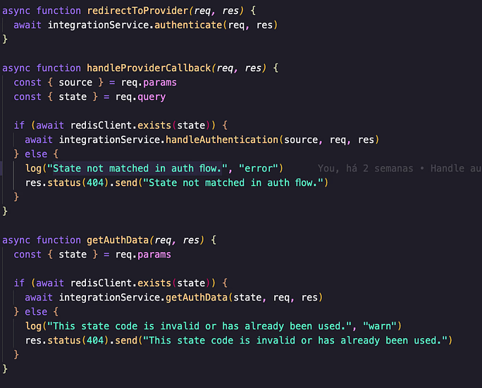

# Generator OAuth Architecture

The generator has its own OAuth architecture, allowing integration and authentication with various APIs. It is product-agnostic, meaning it can be used solely as an authentication platform if needed.

Most APIs use two authentication strategies: OAuth and Custom Credentials, both of which the generator supports.

## Endpoints

There are three endpoints responsible for handling authentication:


### Protected Endpoints

#### `/auth/:source`
This is the entry point for any authentication process, responsible for initiating authentication.

#### `/auth/callback/:source`
Used only in the OAuth flow, this endpoint receives the callback from external providers.


### Unprotected Endpoint

#### `/auth/data/:state`
This endpoint retrieves session data stored in Redis. Whenever this endpoint is called, the data is deleted from Redis. It is specifically used to recover credentials or accounts after authentication.


## Architecture

Since all authentication endpoints invoke the `integration-controller`, the process begins here. This controller is responsible for obtaining request data and invoking the `integrationService`, which contains the core authentication logic.



### `integration-controller.js`
Manages incoming requests and delegates authentication logic to the `integrationService`.

### `integration-service.js`
Each network or service being integrated must have its own service file to encapsulate authentication logic. These services must implement required input and output methods.


The `integration-service` maintains a collection of all integrated authentication services. Some endpoints require the `:source` query parameter to instantiate the correct authentication service.

For example, a request to `/auth/facebook` will instantiate `FacebookService`, which contains the specific authentication logic for Facebook.


## Authentication Process

The full authentication process starts when calling the `/auth/:source` route, triggering the `authenticate` function.

### `authenticate`
This initial method requires the following parameters:

- `externalUserId` → An identifier for the user initiating authentication.
- `externalRedirectUrl` → The redirect URL of the product or application interacting with the generator. This URL is used to return the final response.

After validating the parameters, the network service is instantiated. Before calling `authenticate` inside the service, the received parameters are saved in Redis with a unique `state`, which acts as a session token. Any authentication-related information stored in Redis can be retrieved using this `state`.


### `handleAuthentication`
Triggered when a request is received at `/auth/callback/:source`. After the authentication process is completed by the external provider, a callback is received at this endpoint containing the `state`. This allows retrieving the previously stored authentication data from Redis.

Once the network service method is invoked, it must return:

- `accessToken`
- `refreshToken`
- `accounts`

These values are saved in Redis for later retrieval using the `state`. Finally, the user is redirected to the external URL with the `state` appended, enabling the external app to fetch authentication data.


### `getAuthData`
Called when accessing `/auth/data/:state`. This function retrieves stored authentication data from Redis, deletes it, and returns it as a response.


## OAuth Integration

To integrate with an OAuth-based service, a new service must be instantiated with the network's name (`{integration}-service.js`) and imported into `integration-service.js`.

For example, integrating with Facebook:

1. Create `facebook-service.js` inside `src/services/facebook-service.js`.
2. The service must be a class implementing `authenticate` and `handleAuthentication` methods.

In the constructor, add service credentials and set `redirectUri` to `/auth/callback/{network_name}`.

### `authenticate`
This method constructs the OAuth URL, redirecting the user to the external provider's authentication page.


#### How to Obtain the OAuth URL for Each Network?
Most API documentation explains the required OAuth URL and necessary query parameters (e.g., scopes, `client_id`, secrets, etc.).

### `handleAuthentication`
This function automatically receives the callback after external authentication is completed. It must implement logic to retrieve accounts, access tokens, and refresh tokens from the provider.


It must return an object containing:

```json
{
  "accounts": [],
  "refreshToken": "",
  "accessToken": ""
}
```

If the provider does not return some of these parameters, they should be set to `null` (e.g., `return { accessToken, refreshToken: null, accounts: null }`).

Additional helper methods can be added inside the service, but `authenticate` and `handleAuthentication` must be implemented.

## Custom Credentials

For services requiring custom credentials, the integration process is simpler. An array of required dependencies for the integration must be defined.

The generator does not store API tokens or request credentials from users; this responsibility falls on the external service interacting with the generator.


### Custom Credentials Flow

Within `authenticate`, specify the necessary fields for integration and call `storeRequiredFields`, which updates Redis with the required fields.


After specifying the fields, you need to build the modal instructions, which will

The `handleAuthentication` method can be left empty, as there is no callback in these cases.

#### Example: ActiveCampaignService

Below is an example of a service using custom credentials for ActiveCampaign integration. This service defines the required fields and instructions, which are used to dynamically build the authentication modal on the front-end:

```js
const get = require("lodash.get");
const { ACTIVE_CAMPAIGN_API_VERSION } = require("../../configs");
const { storeRequiredFields } = require("./required-fields")
const axios = require("axios")

class ActiveCampaignService {
  constructor() {}

  async authenticate(req, res, state = null) {
    const requiredFields = ["apiUrl", "apiKey", "accountName"];
    const externalRedirectUrl = await storeRequiredFields(state, requiredFields,  ActiveCampaignService.instructions)
    res.status(200).send(`${externalRedirectUrl}?state=${state}`)
  }

  async handleAuthentication(req, res) {
    return
  }

  static instructions = {
    source: "active_campaign",
    inputs: [
      {
        apiUrl: {
          id: "apiUrl",
          label: "URL",
          type: "text",
          placeholder: "https://yourstore.com",
          references: "source_token"
        }
      },
      {
        apiKey: {
          id: "apiKey",
          label: "Key",
          type: "text",
          placeholder: "Key",
          references: "source_id"
        }
      },
      {
        accountName: {
          id: "accountName",
          label: "Account name",
          type: "text",
          placeholder: "Name",
          references: "source_name"
        }
      }
    ],
    description: [
      {
        type: "description",
        content: [
          { type: "bold", value: "ActiveCampaign" },
          { type: "text", value: " is a Customer Experience Automation platform that has tools such as email marketing, marketing automation, and CRM." },
        ]
      },
      {
        type: "description",
        content: [
          { type: "text", value: "To integrate with ActiveCampaign, follow the steps below:" }
        ]
      }
    ],
    instructions: [
      {
        type: "step",
        step_number: 1,
        content: [
          { type: "text", value: "Log in to your " },
          { type: "link", value: "ActiveCampaign", url: "https://www.activecampaign.com/br/login" },
          { type: "text", value: " account and click on " },
          { type: "bold", value: "Settings" },
          { type: "text", value: " in the side menu. Then click on the " },
          { type: "bold", value: "Developer" },
          { type: "text", value: " option." }
        ]
      },
      {
        type: "step",
        step_number: 2,
        content: [
          { type: "text", value: "In this option, a block " },
          { type: "bold", value: "\"Access to API\"" },
          { type: "text", value: " will appear. Return to Reportei, and " },
          { type: "bold", value: "copy and paste" },
          { type: "text", value: " the " },
          { type: "bold", value: "URL" },
          { type: "text", value: " and " },
          { type: "bold", value: "key" },
          { type: "text", value: " into the fields indicated below." }
        ]
      },
      {
        type: "step",
        step_number: 3,
        content: [
          { type: "text", value: "Finally, define below the name that will " },
          { type: "bold", value: "identify" },
          { type: "text", value: " this integration and that " },
          { type: "bold", value: "will appear in your ActiveCampaign reports" },
          { type: "text", value: " on Reportei." }
        ]
      }
    ]
  };
}
```

The `requiredFields` and `instructions` are used by the front-end to render a modal like the example below:

<div style="max-width: 200px; margin-bottom: 16px;">
  
</div>

The user is guided step-by-step to obtain and input the necessary credentials, ensuring a smooth integration process.

### Fetching Authentication Data

When the external service requests authentication data via `/auth/data/:state`, it receives the required dependency array for the network.

#### Example Response
```json
{
  "source": "active_campaign",
  "requiredFields": ["apiKey", "clientSecret"]
}
```

The external service must request and store these credentials from the user.

