# Integration in the Generator

Before starting development, it is essential to clarify some factors that may impact the integration:

Checklist and Extreme API Cases – [Checklist](./checklist.md)

Before starting the integration in generator, it is important to have predefined the metrics structure. This is what generator will receive in the payload for `/source` endpoint.

Metrics structure - [Metrics](./metrics.md)


The integration in the generator is based on three stages: Authentication, Metric Collection, and Metric Formatting.

## Initial Setup

First, run the command:

```sh
npm run generate:integration -- IntegrationName
```

This will generate a foundation with the necessary files to build the network (similar to the `php artisan make:` command in Laravel).

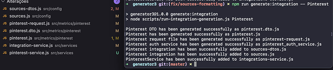

## Simulating Pinterest Integration

Regarding the generated files, here are their respective functions:

### `{integration}-service.js`
This file contains all authentication logic with the integration's API.
By default, the command creates a template for authenticating with an API using OAuth.
For more details on the supported authentication types and the end-to-end authentication flow, refer to this documentation.

Authentication for the new integration - [Authentication](./authentication.mdd)

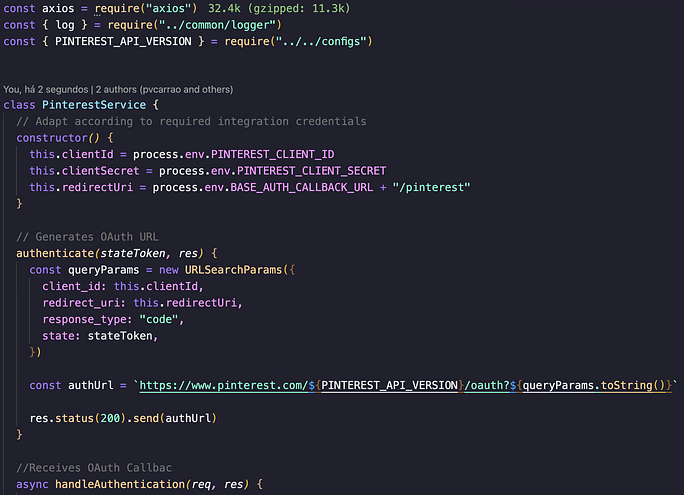

### `{integration}.dto.js`
Acts as a proxy between `sources-controller.js` and the integration's main file (`{integration}.js`).
It receives request data and adapts it in a way that the main file can use.

### `{integration}.js`
This class serves as the main file for building the network. All business logic, metric formatting, and API responses should be contained within this class. It must implement the `getSourceData()` method, which serves as the entry point for the class and returns the formatted metrics according to the standard return format.

Standard return format - [Standard Return Format](./return_format.md)

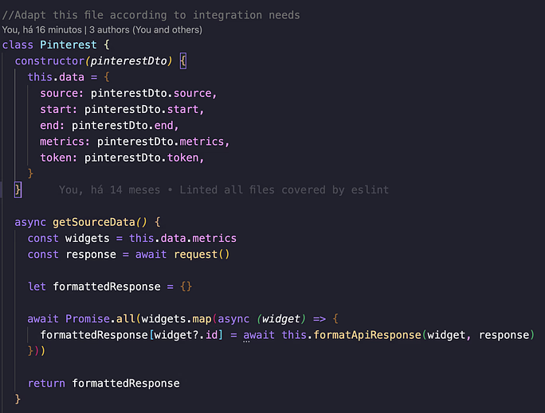

### `{integration}-request.js`
This file should contain all methods related to API requests, such as token refresh and request construction. A utility class, `ApiHandler`, is already imported to handle requests, pagination, and retries.

### `/utils`
This directory is a suggested location for network-specific utilities and should not contain any core logic.
For example, in the Pinterest integration, it stores pre-calculated metrics and a function that converts currency to the network-specific format.

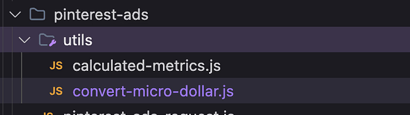

## Automatic Modifications

Along with these generated files, the command also modifies `sources.js`, `sources-dto.js`, and `integration-service.js`. These modifications only involve imports so that network classes are instantiated automatically according to incoming requests. There is no need to modify these files unless an error is detected.

## Authentication

The authentication process involves obtaining authorization tokens and accounts for metric collection. This process can occur via OAuth or Custom Credentials. Authentication documentation is available [here](./authentication.md), and should be followed to implement authentication for the new network.

It is important to note that authentication only serves to save account credentials in the product interacting with the generator (e.g., Reportei, Sync). Network tokens will be forwarded to the generator via headers (prefix `X-`, e.g., `X-Access-Token`).

## Collecting metrics

Metric collection involves making API requests. As mentioned earlier, this logic should be implemented inside `{integration}-request.js`. This process may vary depending on the API, but it generally follows these steps:

1. Token refresh
2. Request construction
3. Request execution

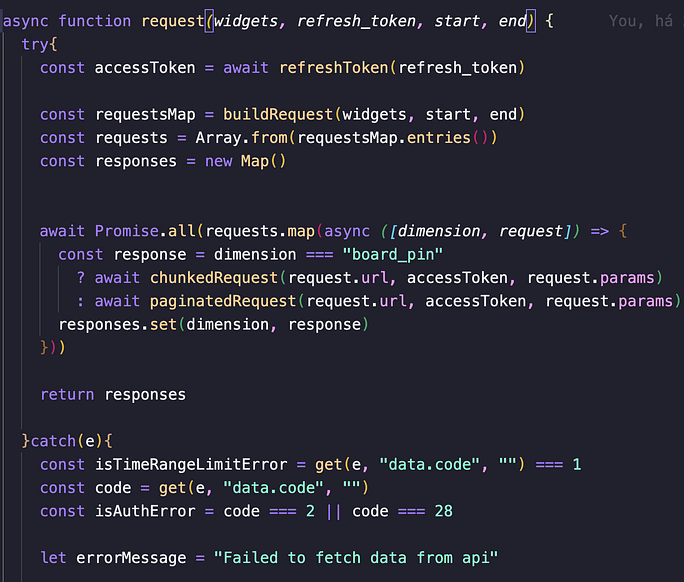

### Defining "Pivots"

When constructing request logic, it's important to consider the metrics to be obtained for the new integration and organize them using "pivots."

#### What is a "pivot"?
A pivot can be a specific endpoint or dimension sent to the API. For example:

- `/user` → user account data
- `/posts` → post-related data

Establishing this relationship is crucial as it helps organize requests according to widget dimensions. This allows fetching dimensions directly and using them to construct requests for different API sections.

For example, in the Pinterest integration, a request constructor (`buildRequest`) groups all widgets by dimension and makes requests applicable to all metrics sharing that dimension. Each dimension corresponds to an endpoint and is also heavily used in formatting.

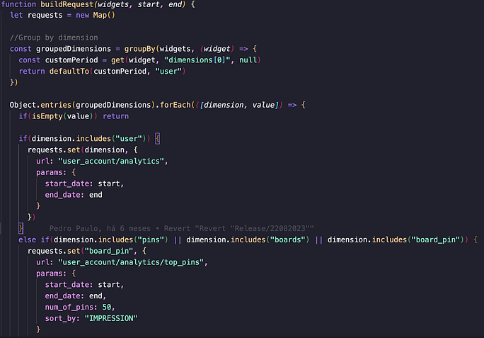

The final result is a `Map` associating each dimension with its API response.

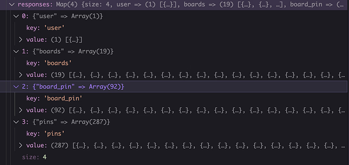

### Recommended Approach

While this scenario assumes a well-documented API with clearly separated endpoints, it is highly recommended to group requests by dimensions and construct them accordingly.

## Formatting

Once all necessary metric data has been retrieved, methods must be created to format API responses according to each metric. The final format should always be a table, in the [standard format](./return_format.md), ensuring the network is unaware of widget types (e.g., datatable, chart, number).

### Formatting Challenges

Formatting is the most complex yet essential part of integration. It involves numerous dimension checks and data manipulations.

### Formatting Logic

Assuming the relationship between dimensions and API responses is established, the process involves:

1. Mapping widgets (`metrics`) by sending the widget and API response to another function.

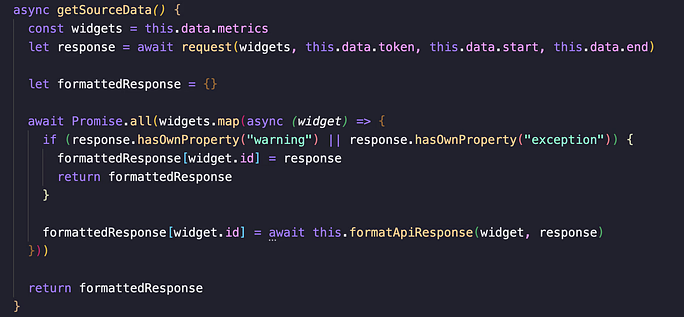

2. Creating a default response structure (`defaultResponse`).

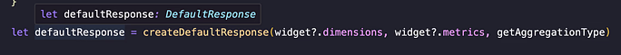

3. Obtaining the API response for the widget’s dimension (`responseValue`).

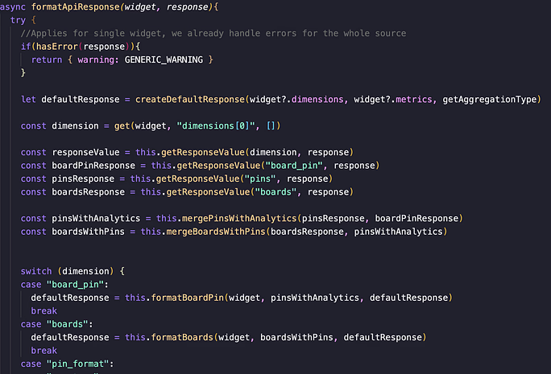

4. Invoking a function to handle responses for that dimension.

For example, in Pinterest, the function `mergePinsWithAnalytics` combines `pins` and `boards` responses.

### Example: Formatting "Boards"

The formatting of an API response using the "boards" dimension (in a `switch-case` statement) involves:

- Receiving the default response as a parameter
- Filling values based on the API response via mapping

If the response contains images (`thumbnail`), the first value in the row should include an object with `text`, `image`, and `url`. This is necessary whenever tables with images are constructed.

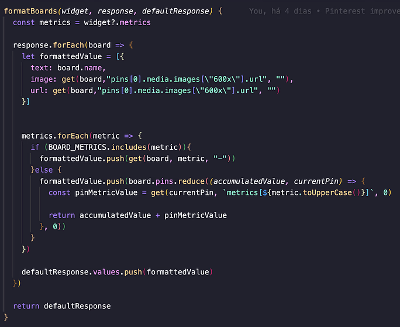

### Final Output Format

The final output of any formatting function must be an object following the standard format:

Standard Return Format - [Standard Return Format](./return_format.md)

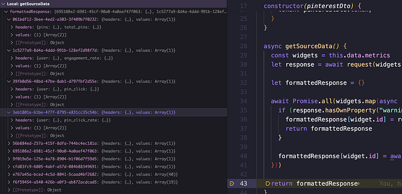

With this, the last stage of network addition is complete. The methods explained in the lifecycle will handle the final adjustments automatically. Be mindful of errors at this stage; after formatting the objects, they are validated by `formatter-handler`.

Of course, some integrations will be more complex, and this document describes the ideal scenario to follow.

