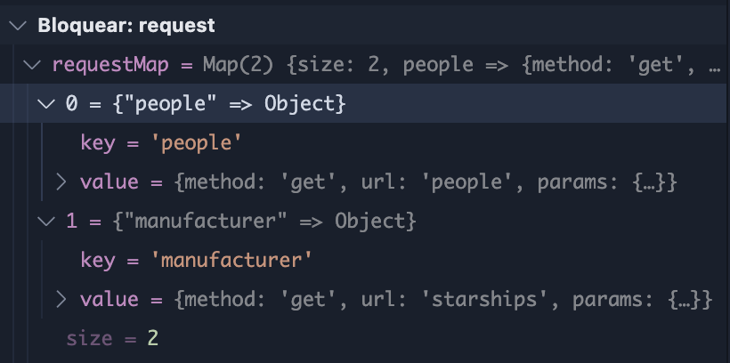
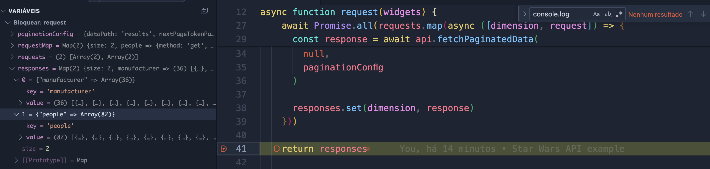
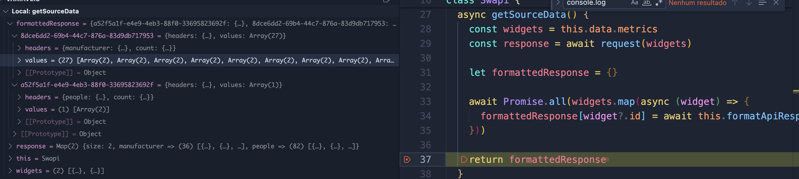

# Practical Example with Star Wars API

In this example we will be showing a step-by-step guide to add metrics from the [Star Wars API](https://swapi.dev/about) to Reportei.

The metrics we are going to have are:
- Total Characters in the Database (Number Metric)
- Starships by Manufacturer (Table Metric)

**Important**

The code for the following tutorial is complete in the branch [Practical-Example](https://github.com/reportei/generator-community/tree/example/star-wars-api).

It is very important that you know the purpose of each file and step of the process, please refer to [New Integration](./new_integration.md).


## 1. Configuring the metrics
### 1.1. Widgets Definition

Inside `src/payloads/`, create a file named `swapi-widgets.json` with the following content.

```json
{
  "metrics": [
    {
      "id": "a52f5a1f-e4e9-4eb3-88f0-33695823692f",
      "reference_key": "swapi:total_characters",
      "component": "number_v1",
      "dimensions": [
          "people"
      ],
      "metrics": [
        "count"
      ]
    },
    {
      "id": "8dce6dd2-69b4-44c7-876a-83d9db717953",
      "reference_key": "swapi:starships_by_manufacturer",
      "component": "datatable_v1",
      "dimensions": [
        "manufacturer"
      ],
      "metrics": [
        "count"
      ]
    },
  ]
}

```

**Note that the `people` dimension refers exactly to the peple api endpoint.**

These files inside payloads are only used on our side after the PR is accepted, it has no use during the development.

The SwapiWidgets array is exactly what is sent in the body of the `/source` endpoint.


### 1.2. Widget References

Inside `src/payloads/`, create a file named `swapi-references.json` with the following content.

This file will contain the metadata for the metrics, like description, labels, title, etc.

```json
{
  "swapi:starships_by_manufacturer": {
    "title": "Starships by Manufacturer",
    "description": "The number of starships made by each manufacturer.",
    "labels": ["Manufacturer", "Count"],
    "tags": {
        "cost": "organic",
        "calculation": "Passed through the network",
        "value": "total value",
        "history": "retroactive"
    }
  },
  "swapi:total_characters": {
    "title": "Total Characters",
    "description": "The total number of characters in the database.",
    "tags": {
        "cost": "organic",
        "calculation": "Passed through the network",
        "value": "total value",
        "history": "retroactive"
    }
  }
}
```

### 1.3. Integration Setup

Inside `src/payloads/`, create a file named `swapi-setup.json` with the following content.

```json
{
  "metrics": {
    "count": {
        "label": "Count"
    },
  },
  "dimensions": {
    "manufacturer": {
      "label": "Manufacturer",
    },
    "people": {
      "label": "People",
    }
  }
}
```

## 2. Starting the integration

Since the API has no authentication we can skip that part, lets go straight to the metrics collection.

### 2.1. Postman

The endpoint used to consume the integration will be `/source`, after downloading the [postman collection](./collection/Generator%20Community.postman_collection.json) open the `{your-network} Get Data` and rename it to `SwApi Get Data`.

After that we need to configure the request body, it should look something like this:

```json
{
  "awaitForAllMetrics": true,
  "sourceName": "swapi",
  "sourceId": "20bc9434-7dc5-4770-a6fb-261298f546d9",
  "start": "2025-01-01",
  "end": "2025-01-31",
  "comparison_start": "2024-01-01",
  "comparison_end": "2024-01-31",
  "metrics": [
    {
      "reference_key": "swapi:total_characters",
      "component": "number_v1",
      "dimensions": [
          "people"
      ],
      "metrics": [
        "count"
      ]
    },
    {
      "reference_key": "swapi:starships_by_manufacturer",
      "component": "datatable_v1",
      "dimensions": [
        "manufacturer"
      ],
      "metrics": [
        "count"
      ]
    }
  ]
}
```

**Attributes**:
- `awaitForAllMetrics`: inficates if the data should be returned by webhook or not
- `sourceName`: name of the source
- `sourceId`: id of the source
- `start`: start date of the report
- `end`: end date of the report
- `comparison_start`: start date of the comparison report
- `comparison_end`: end date of the comparison report
- `metrics`: metrics you wish to request, these are the same defined in the `swapi-widgets.json` file.

**Important**

In this case the `sourceId` attribute is just a random uuid because SWapi only returns static data, during a real case scenario, `sourceId` should be the account id.

And no headers are being passed, if the network requires auth, they should be passed as:

- X-Access-Token
- X-Refresh-Token

### 2.2. Creating Integration Scaffold

cd into the `generator-community` repository you cloned and run the following command to generate the required files for the integration:

```sh
npm run generate:integration -- Swapi
```

### 2.3. Metric Collection

Now that the scaffold is created, we can start the metric collection.

Access the file `src/metrics/swapi.js` which is the main file for the integration.

First we need to make some modification to the request file, in order to build the requests, we need to pass in the widgets from the request body.

```javascript
async getSourceData() {
  const widgets = this.data.metrics
  //Passed widgets to request
  const response = await request(widgets)

  let formattedResponse = {}

  await Promise.all(widgets.map(async (widget) => {
    formattedResponse[widget?.id] = await this.formatApiResponse(widget, response)
  }))
  
  return formattedResponse
}
```

## 3. Metrics Request
### 3.1 Request building

Now we are going to use the `src/metrics/swapi-request.js` file to build the requests.

For that we need to group the widgets by dimension 
to know which endpoints we need to hit.

You request file should look like this:

```javascript
//Use default api handler to consume integration api
const baseUrl = process.env.SWAPI_BASE_URL // https://swapi.dev/api
const api = new ApiHandler(baseUrl)

async function request(widgets) {
  const requestMap = buildRequest(widgets)
  console.log(requestMap)
}

function buildRequest(widgets) {
  let requests = new Map()

  //Group by dimension
  const groupedDimensions = groupBy(widgets, (widget) => {
    const customPeriod = get(widget, "dimensions[0]", null)
    return defaultTo(customPeriod, "people")
  })

  Object.entries(groupedDimensions).forEach(([dimension, value]) => {
    if(isEmpty(value)) return

    if(dimension.includes("manufacturer")) {
      requests.set(dimension, {
        method: "GET",
        url: "starships",
        params: {}
      })
    }
    else {
      requests.set(dimension, {
        method: "GET",
        url: "people",
        params: {}
      })
    }
  })

  return requests
}

```

Here we build the  requests that should be made using the widgets dimensions.

If you hit `/source` endpoit right now you should get this response:




### 3.2 Requesting metrics

Now that we have the the request urls, we need to hit the api, for that we **Must** use the `ApiHandler`, as it includes many fail-safe and utilities to consume apis.

**Important**

All of the requests must be made concurrently to improve performance.

Here we added a try catch and a promise all that maps the request Map(), it then assigns the responses to another map.

Note that we created a `paginationConfig` that teaches the `ApiHandler` how to consume the data.

```javascript
async function request(widgets) {
  try {
    const requestMap = buildRequest(widgets)

    const requests = Array.from(requestMap.entries())
    const responses = new Map()

    const paginationConfig = api.createPaginationConfig({
      dataPath: "results",
      nextPageTokenPath: "next",
      type: "url-full",
      pageParam: "page",
      inferNextPage: false
    })

    await Promise.all(requests.map(async ([dimension, request]) => {
      
      const response = await api.fetchPaginatedData(
        request.method,
        request.url,
        null,
        request.params,
        null,
        paginationConfig
      )

      responses.set(dimension, response)
    }))


    console.log(responses)
    return responses

  } catch (error) {
    logger.error(error)
    return new Map()
  }
}
```

Now if you hit `/source` endpoit right now you should get this log containing the data foreach dimension:


During these tests in postman you will receive the following response:

```json
{
  "a52f5a1f-e4e9-4eb3-88f0-33695823692f": {
      "warning": "There is no data for the selected period"
  },
  "8dce6dd2-69b4-44c7-876a-83d9db717953": {
      "warning": "There is no data for the selected period"
  }
}
```

## 4. Metrics Formatting

Now that we have a map with the data by dimension, we need to iterate the widgets and transform the data into the [standard return format](./return_format.md).

We will alter the file `src/metrics/swapi.js` to add the formatting logic.

We need to iterate all of the widgets, check if there is a response for them, and if yes, format accordingly.

It should look like this:

```javascript
async getSourceData() {
  const widgets = this.data.metrics
  const response = await request(widgets)

  let formattedResponse = {}
  
  await Promise.all(widgets.map(async (widget) => {
    formattedResponse[widget?.id] = await this.formatApiResponse(widget, response)
  }))
  
  return formattedResponse
}

/**
 * Format the apiResponse and fill defaultResponse
 * values for each widget
 * 
 * @param {object} widgets 
 * @param {unknown} response 
 * @returns {Promise<DefaultResponse>}
*/
async formatApiResponse(widget, response) {
  try {
    let defaultResponse = createDefaultResponse(widget?.dimensions, widget?.metrics)
    const responseForWidget = response.get(widget?.dimensions[0])

    if(!responseForWidget) return {warning: GENERIC_WARNING}
  
    if(widget?.dimensions?.includes("manufacturer")) {
      //Group response data by manufacturer, 
      const dataByManufacturer = groupBy(responseForWidget, (item) => {
        const manufacturer = get(item, "manufacturer", null)
        return defaultTo(manufacturer, "Unknown")
      })

      Object.entries(dataByManufacturer).forEach(([manufacturer, data]) => {
        let row = []

        Object.entries(defaultResponse.headers).forEach(([key, value]) => {
          if(value.isDimension) {
            row.push(manufacturer)
          } else if(key === "count") {
            row.push(data.length)
          }
          //Handle more metrics if needed
        })

        defaultResponse.values.push(row)  
      })

    } else {
      Object.entries(defaultResponse.headers).forEach(([key, value]) => {
        if(key === "count") {
          //Since its a number, we dont need to segmentate by dimension and can
          //pass the count instead
          defaultResponse.values.push([null, responseForWidget.length])
        }
        //Handle more metrics if needed
      })
    }

    return defaultResponse
  } catch (error) {
    log(error, "info")
    return {exception: GENERIC_EXCEPTION} 
  }
}
```

Finally if we log `formattedResponse` we will se the end result, which are two tables with the data:



Now you dont need to worry about changing anything, the formattedResponse is correct, so the file `FormattedHandler` will take care of changing this response into a `number_v1` and a `datatable_v1`.

The response you should receive in postman will be the following:

```json
{
    "a52f5a1f-e4e9-4eb3-88f0-33695823692f": {
        "values": 82,
        "comparison": {
            "values": 82,
            "difference": 0,
            "absoluteDifference": 0
        }
    },
    "8dce6dd2-69b4-44c7-876a-83d9db717953": {
      "headers": {
          "manufacturer": {
              "metric": "manufacturer",
              "isDimension": true,
              "aggType": null
          },
          "count": {
              "metric": "count",
              "isDimension": false,
              "aggType": null
          }
      },
      "values": [
          [
              "Corellian Engineering Corporation",
              3
          ],
          [
              "Kuat Drive Yards",
              2
          ],
          [
              "Sienar Fleet Systems, Cyngus Spaceworks",
              1
          ],
          [
              "Imperial Department of Military Research, Sienar Fleet Systems",
              1
          ],
          [
              "Koensayr Manufacturing",
              1
          ],
          [
              "Incom Corporation",
              1
          ],
          [
              "Sienar Fleet Systems",
              2
          ],
          [
              "Kuat Drive Yards, Fondor Shipyards",
              1
          ],
          [
              "Gallofree Yards, Inc.",
              1
          ],
          [
              "Kuat Systems Engineering",
              4
          ]
      ]
  }
}
```


