# Standard Response Format in the Generator

Each network implemented in the generator must return data in a single format: a table, referred to in the code as `DefaultResponse`. It consists of the following structure:

## `DefaultResponse` Structure

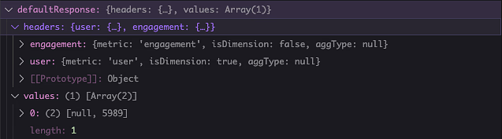

A JSON object with two attributes: `headers` and `values`.

### `headers`
An object that acts as the table's "columns." Each header has a metric name as its key and contains several properties:

- `metric` → References a metric or dimension.
- `isDimension` → Indicates whether the column represents a dimension.
- `aggType` → Option to add an aggregation type to this column, useful when a metric requires specific calculations.

### `values`
Represents the table rows, structured as an array of arrays where each item corresponds to a `header`.

## Creating a Default Response

To standardize responses, some networks (such as Pinterest) define the return type explicitly as `DefaultResponse` within the `formatApiResponse` method.

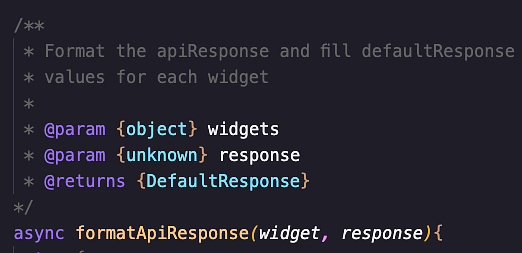

### Example: `Pinterest.js`
New networks also import this type definition at the top of their files by default.

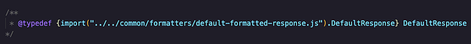

Whenever formatting a metric, the `createDefaultResponse` method must be called. By default, it receives the metrics and dimensions of each widget and automatically creates the necessary headers. This allows developers to focus only on populating the response values.

### Example Debugging `defaultResponse`
At the beginning of `formatApiResponse`, we call `createDefaultResponse`, which provides a template with the required headers and an empty `values` array ready to be filled.

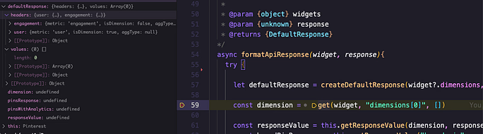

## `default-formatted-response.js` Module

Located at `src/common/formatters/default-formatted-response.js`, this file contains the function responsible for generating the standard response (`createDefaultResponse`).

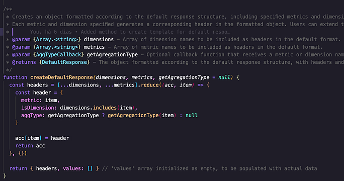

### Basic Usage
The basic usage of this function requires only the dimensions and metrics of each widget, as shown in the following example:

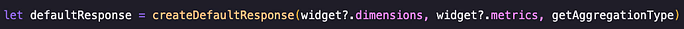

As mentioned earlier, this function can also accept a callback function to assign an aggregation type to a header. For example, in Pinterest, this function is passed from:

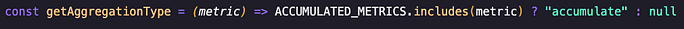

Any function returning an aggregation type is valid, provided it returns a string (e.g., `"accumulated"`) or `null`.

### Using Aggregation Types
Observe how the aggregation type in a header is used to calculate a metric value:

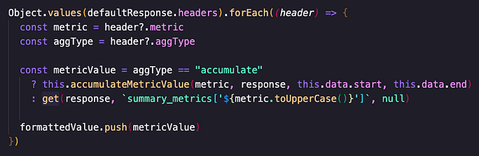

The instructions for using a callback function in `createDefaultResponse` are documented in the type definitions within `default-formatted-response.js`.

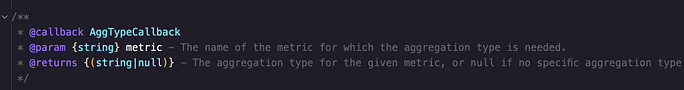

## Why Must All Networks Use the Standard Table Format?

This architectural decision ensures that integrations do not need to distinguish between different widget types (e.g., charts, numbers, or tables in a product like Reportei).

By standardizing `DefaultResponse` as a table format, it can easily be transformed into charts or numbers. Developers working on integrations only need to return tables, while an internal generator layer transforms these tables into different widgets.

## How Does the Generator Transform Tables into Charts and Numbers?

When developing a new integration, there is no need to interact with this part of the code.

Within `sources-controller.js`, after receiving the network response (`sourceResponse`), the `FormatterHandler` class is invoked. This class receives:

- The metrics
- The network response
- The comparison response

Located at `src/common/formatters/formatter-handler.js`, this class iterates through each widget and validates whether the response format matches the standard format using the `validate()` method. This method also returns warnings if a widget does not have an associated response.

After validation, based on the widget's component type, it invokes the appropriate formatting method (`this.formatters`) to transform the table format into the respective component.

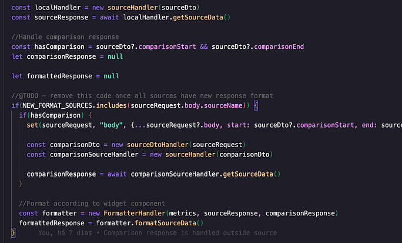

## Important Considerations for Network Development

- Every network must return a table-format response.
- If an API response is not segmented and contains only a single raw value, it must be returned as a table with a single row.

### Example Transformations

#### Example 1: Standard Table Format
A well-structured table in `DefaultResponse` format will appear as a full table in the final output:

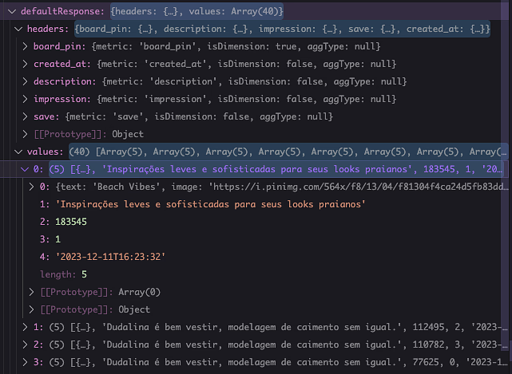

#### Example 2: Single Row Response
A single-row response will be transformed into a number:

In this case, the first value in the first column is `null`, indicating that this is an integer value where the dimension was used only to retrieve complete API data.

These examples illustrate that any properly formatted table can be transformed into charts, tables, or numbers within the generator.

